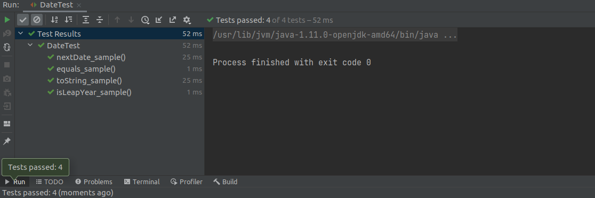
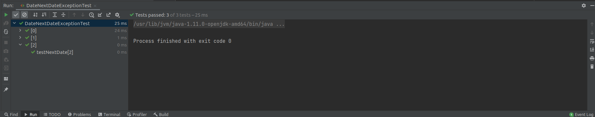
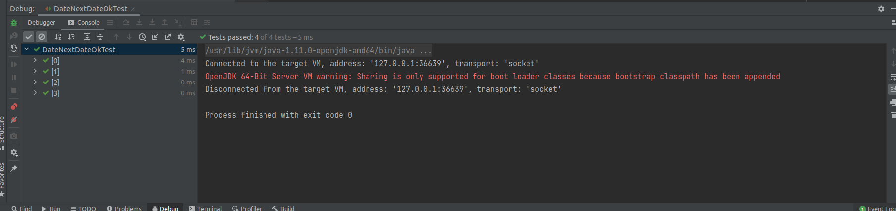

# SEG3103

| Outline | Value |
| --- | --- |
| Name | Alois Clerc |
| Course | SEG 3103 |
| Date | Summer 2021 |
| Professor | Andrew Forward, aforward@uottawa.ca |
| TA | Zahra Kakavand, zkaka044@uottawa.ca |

## Excercise 1

| Test Case        | Expected Results           | Actual Results  | Verdict |
| ------------- |:-------------:| -----:|---:|
| Leave all fields blank      | Errors from all fields | First and Last Name fields gave no errors | Fail |
| Symbols in all fields      | Normal errors from all fields      |   java.lang error from age field | Fail |
| incorrect email format | normal error field from email      |    normal error field from email | Pass |

## DateTest.java results

Paramaterized Tests were created and worked successfully in DateNextDateExceptionTest and DateNextDateOkTest

## ExceptionTest results

## Ok tests results

