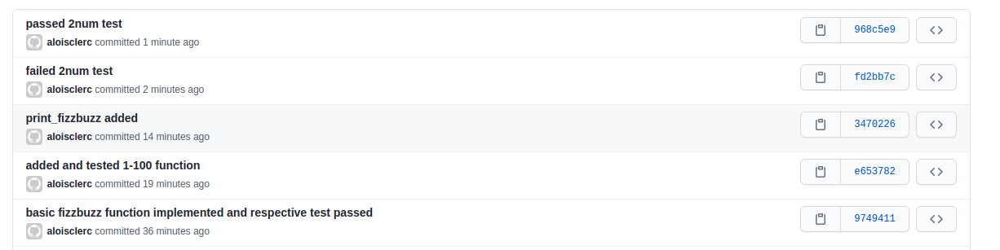
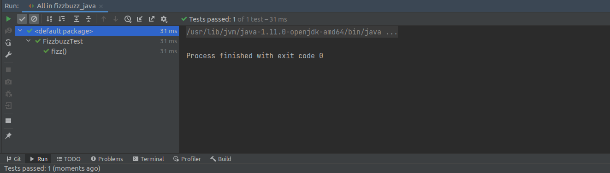
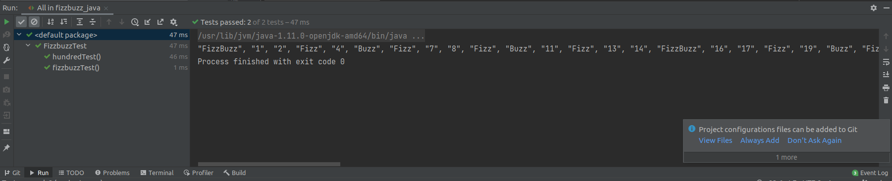
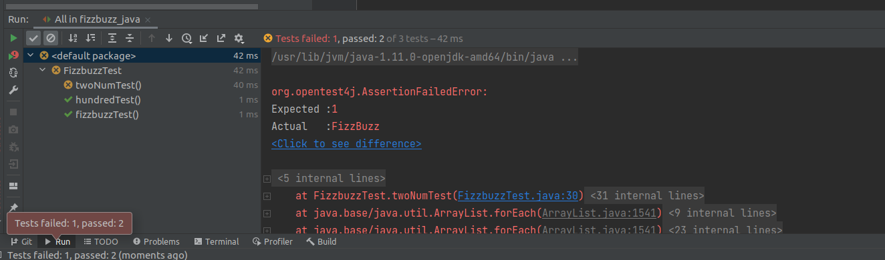
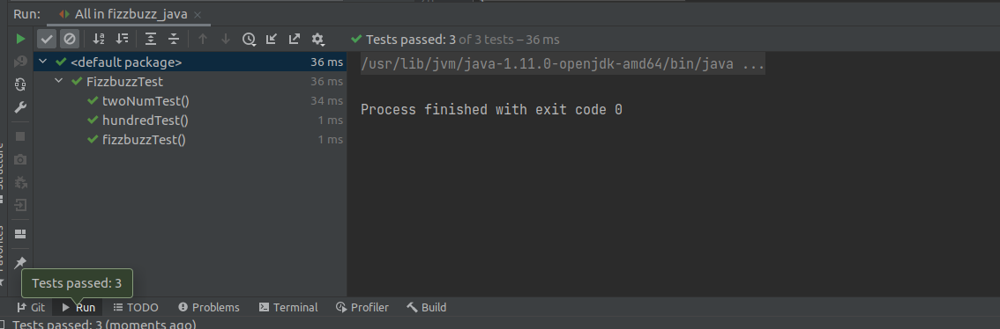

# SEG3103

| Outline | Value |
| --- | --- |
| Name | Alois Clerc |
| Course | SEG 3103 |
| Date | Summer 2021 |
| Professor | Andrew Forward, aforward@uottawa.ca |
| TA | Zahra Kakavand, zkaka044@uottawa.ca |

I chose to implement the Fizzbuzz program in java.
I used identical naming conventions to the elizir files for the functions.
3 major unit tests were devised to test the 3 major functions

## 5 Commit groups(results of the test are below)

## Basic Fizzbuzz function test

The function correctly returned values for Fizz, Buzz, Fizzbuzz, and a number that is neither.

## Hundred Test results

this test simply made sure that the output of fizzbuzz() with no input parameters was correct.

## twoNumFail

My first iteration of the two parameter fizzbuzz(n, m) function was flawed because it always started the fizzbuzz count at 0

## Two Num Success

After finding the root of the problem with my tests, the new set of tests ran successfully.

