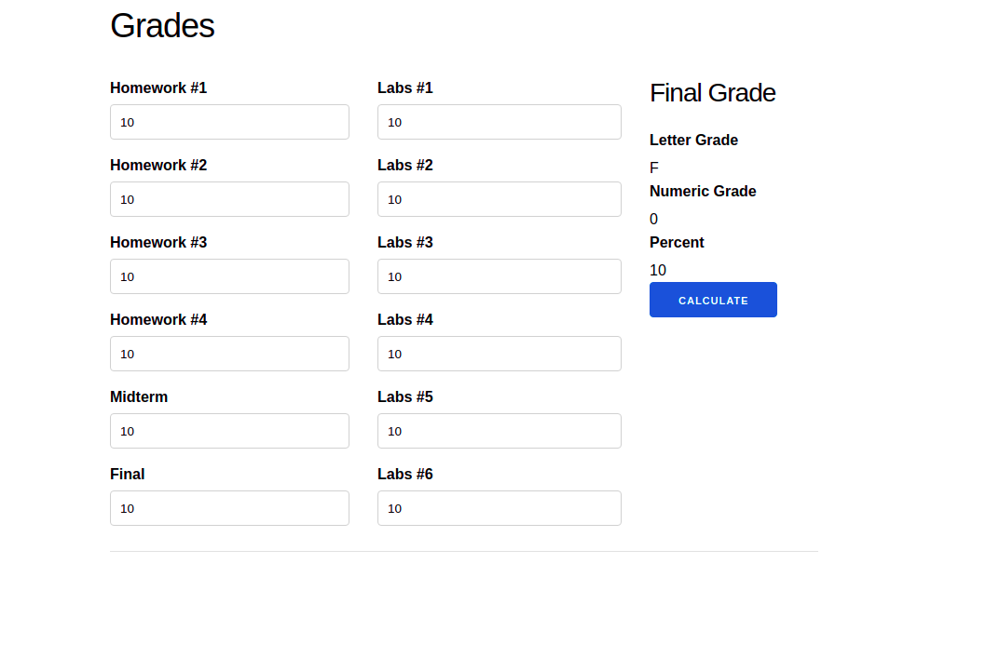

# SEG3103

| Outline | Value |
| --- | --- |
| Name | Alois Clerc |
| Course | SEG 3103 |
| Date | Summer 2021 |
| Professor | Andrew Forward, aforward@uottawa.ca |
| TA | Zahra Kakavand, zkaka044@uottawa.ca |

## Grades Project

After implementing the stubbed functions in Grades.Calculator, the web app functioned(although it gave incorrect and random outputs)

AFter implementing the real functions from Assignment 2, the web app returned the correct values.

### Notes
    - Seperating the concerns by starting out with the stubs, took a lot of potential confusion 
    relating to input parameters and return values when it came time to implement the real functions
    - Additionally, any errors I recieved while implementing the real functions had to have been from the code that was added which
    simplified debugging.
    - There was a stage of the project that was working before the real functions were implemented,
    so while coding I attempted to return to that working state.

## Twitter

Two of the implemented tests failed upon running which exposed a lot of problems with the current implementation of the function

First, the function didnt check if the user is a substring of a different user. This caused is_Mentionned("me") to return true
for a tweet mentioning @meat

Second, the function didn't have any try catch block to catch situations where no tweet is loaded

With this testing knowledge it was very easy to fix the function and with the updated function, every test runs correctly

