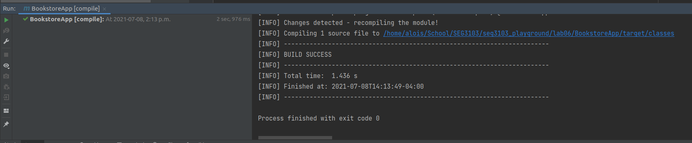
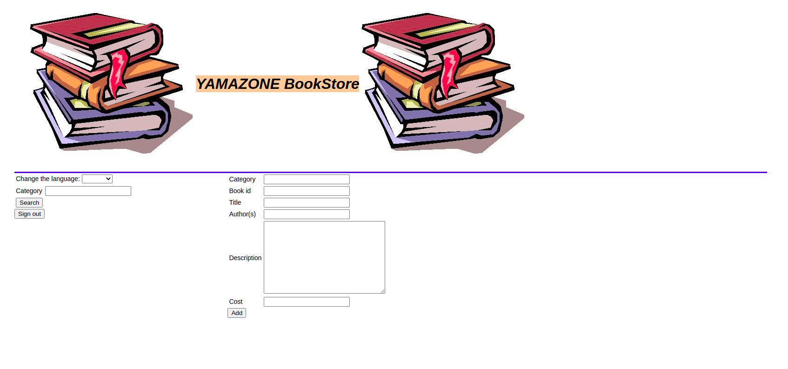
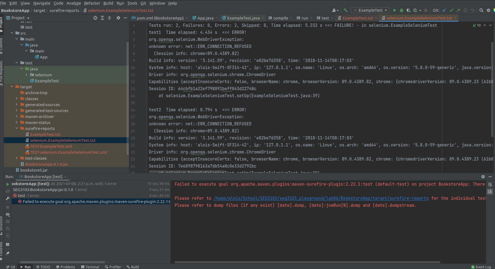
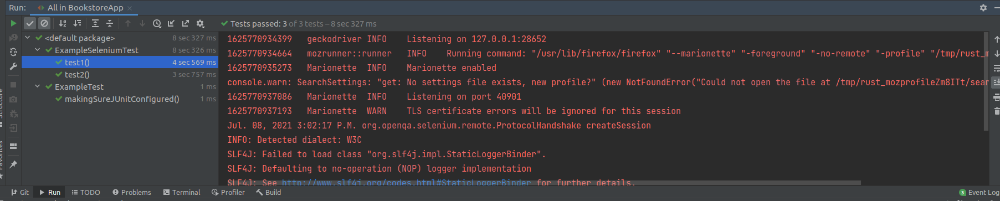
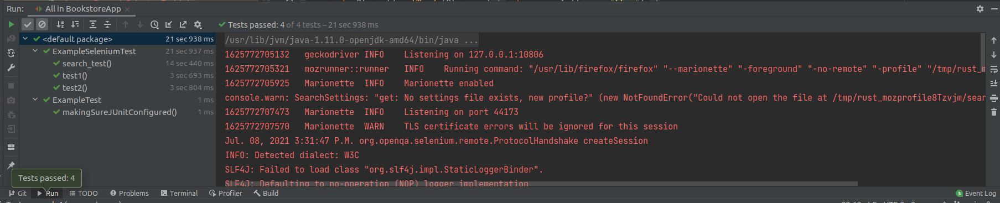

# SEG3103

| Outline | Value |
| --- | --- |
| Name | Alois Clerc |
| Course | SEG 3103 |
| Date | Summer 2021 |
| Professor | Andrew Forward, aforward@uottawa.ca |
| TA | Zahra Kakavand, zkaka044@uottawa.ca |

## Selenium Project

### When I first unpackaged the application I successfully compiled it using `mvn compile`

### As can be seen below, running `java -jar ./target/BookstoreApp-0.1.0.jar` resulted in a fully functional 
### web page where I was able to access the main interface and the admin side of the website

### Unfortunately, when I attempted to run the selenium code, it responded with errors. After reading the error message, it was clear that there were errors with the browser drivers

### To fix this, I changed the driver to firefox in the test code, I downloaded geckodriver, and when I ran the tests again this time they worked!

### Now I implemented an additional selenium test. This test very simply entered a blank search into the categories bar and makes sure that the welcoming paragraph disappears off the page and is replaced by search results.
### When I ran this test it passed!
