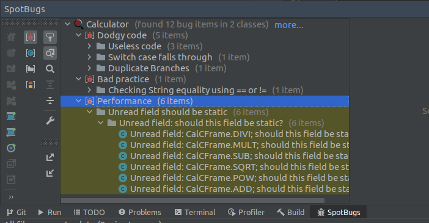
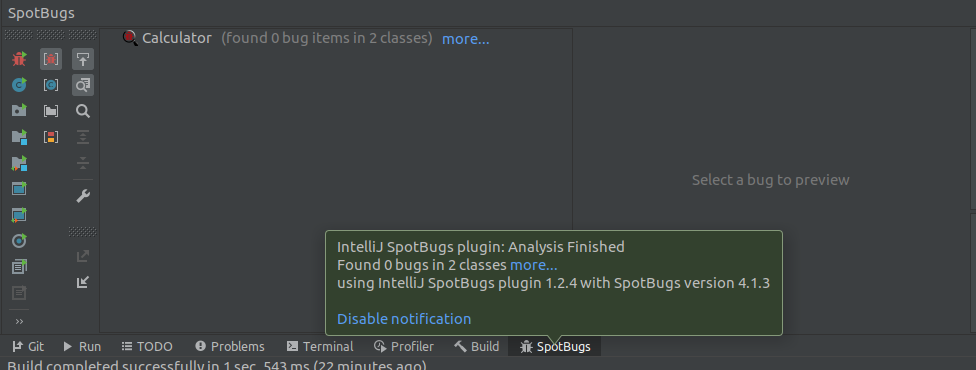
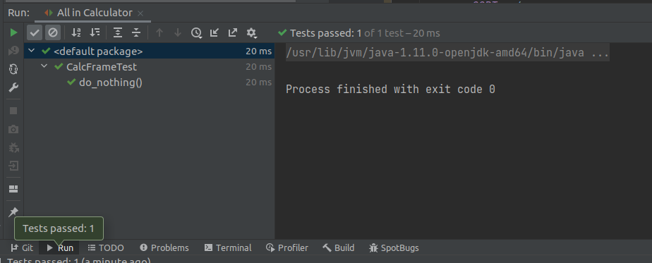

# SEG3103

| Outline | Value |
| --- | --- |
| Name | Alois Clerc |
| Course | SEG 3103 |
| Date | Summer 2021 |
| Professor | Andrew Forward, aforward@uottawa.ca |
| TA | Zahra Kakavand, zkaka044@uottawa.ca |

## BugSpot Project

### I compiled and ran the calculator application, then I installed the BugSpot Intellij Plugin and these were the results after running it on the CalCFrame.java file

### I analyzed all of the bug reports and made the necessary changes to fix them as requested in the lab slides.
### When the BugSpot scan was run again, this time there were no bugs

### After the bugspot scan I ran the tests once again to ensure that nothing was broken.
